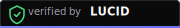
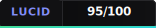

# LUCID Badges

Display your LUCID verification status in your project README, documentation, or website.

## Badge Variants

### Verified by LUCID

The primary badge indicating your project has passed LUCID verification.

**Default (shield style):**



**Flat:**


**Flat Square:**


**For the Badge:**


---

### LUCID Score

Show your project's LUCID verification score. Replace `95/100` with your actual score.

**Default (shield style):**



**Flat:**


---

### LUCID Certified

Premium certification badge for projects that achieve 90+ score.


---

## Usage

### Markdown (for README.md)

**Verified by LUCID (linked to trylucid.dev):**

```markdown
[](https://trylucid.dev)
```

**With score:**

```markdown
[](https://trylucid.dev)
```

**Certified:**

```markdown
[](https://trylucid.dev)
```

**From GitHub (use raw URL):**

```markdown
[](https://github.com/gtsbahamas/hallucination-reversing-system)
```

---

### HTML (for websites)

**Basic embed:**

```html
<a href="https://trylucid.dev" target="_blank" rel="noopener noreferrer">
  
</a>
```

**With score:**

```html
<a href="https://trylucid.dev" target="_blank" rel="noopener noreferrer">
  
</a>
```

**Dark background context (no extra styling needed -- badges are designed for dark backgrounds):**

```html
<div style="background: #0a0a0b; padding: 16px; display: inline-block; border-radius: 8px;">
  <a href="https://trylucid.dev" target="_blank" rel="noopener noreferrer">
    
  </a>
</div>
```

**Light background wrapper:**

```html
<div style="background: #18181b; padding: 8px 12px; display: inline-block; border-radius: 6px;">
  <a href="https://trylucid.dev" target="_blank" rel="noopener noreferrer">
    
  </a>
</div>
```

---

### RST (for Python docs)

```rst
.. image:: https://trylucid.dev/badge/verified.svg
   :target: https://trylucid.dev
   :alt: Verified by LUCID
```

---

### AsciiDoc

```asciidoc
image:https://trylucid.dev/badge/verified.svg[Verified by LUCID, link=https://trylucid.dev]
```

---

## Badge Styles

| Style | File | Best For |
|-------|------|----------|
| Default (shield) | `verified-by-lucid.svg` | READMEs with dark themes, marketing pages |
| Flat | `*-flat.svg` | Shields.io-style badge rows in READMEs |
| Flat Square | `*-flat-square.svg` | Minimal, modern READMEs |
| For the Badge | `*-for-the-badge.svg` | Hero sections, prominent placement |

---

## How to Earn the Badge

### Step 1: Run LUCID on Your Project

```bash
# Clone and install LUCID
git clone https://github.com/gtsbahamas/hallucination-reversing-system
cd hallucination-reversing-system
npm install

# Or use the GitHub Action
# See: https://github.com/gtsbahamas/hallucination-reversing-system/tree/main/.github/actions/lucid-verify
```

### Step 2: Verify Your Code

```bash
# Generate hallucinated specification
lucid hallucinate --project /path/to/your/project

# Extract testable claims
lucid extract

# Verify against your codebase
lucid verify
```

### Step 3: Check Your Score

LUCID outputs a verification score from 0 to 100:

| Score | Badge Level | Meaning |
|-------|-------------|---------|
| 90-100 | **LUCID Certified** | Exceptional -- code matches specification with high fidelity |
| 70-89 | **Verified by LUCID** | Good -- verified with minor gaps |
| 50-69 | *No badge* | Needs improvement -- significant gaps between spec and code |
| 0-49 | *No badge* | Unverified -- major discrepancies |

### Step 4: Add the Badge

Once your project scores 70+, add the badge to your README:

```markdown
[](https://trylucid.dev)
```

For scores 90+, use the certified badge:

```markdown
[](https://trylucid.dev)
```

### Step 5: Keep It Current

Run LUCID verification in CI to keep your badge up to date:

```yaml
# .github/workflows/lucid.yml
name: LUCID Verification
on: [push, pull_request]
jobs:
  verify:
    runs-on: ubuntu-latest
    steps:
      - uses: actions/checkout@v4
      - uses: gtsbahamas/hallucination-reversing-system/.github/actions/lucid-verify@main
        with:
          project-path: .
```

---

## Brand Colors

The badges use the official LUCID brand palette:

| Color | Hex | Usage |
|-------|-----|-------|
| Background | `#0a0a0b` | Badge background |
| Surface | `#111113` | Secondary background |
| Border | `#27272a` | Subtle borders |
| Accent (Indigo) | `#818cf8` | LUCID brand color |
| Accent Hover | `#6366f1` | Deeper indigo |
| Green | `#4ade80` | Pass / verified states |
| Cyan | `#22d3ee` | Score gradient accent |
| Text Primary | `#fafafa` | Primary text |
| Text Secondary | `#a1a1aa` | Secondary text |

---

## Files

```
docs/badge/
  verified-by-lucid.svg             # Shield style (default)
  verified-by-lucid-flat.svg        # Flat style
  verified-by-lucid-flat-square.svg # Flat square style
  verified-by-lucid-for-the-badge.svg # Large "for the badge" style
  lucid-score.svg                   # Score badge, shield style (95/100 example)
  lucid-score-flat.svg              # Score badge, flat style
  lucid-certified.svg               # Premium certification badge
  README.md                         # This file
```

---

## License

These badges are part of the LUCID project and are available under the MIT License. You may use them freely in any project that has been verified by LUCID.
