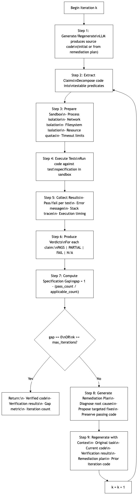
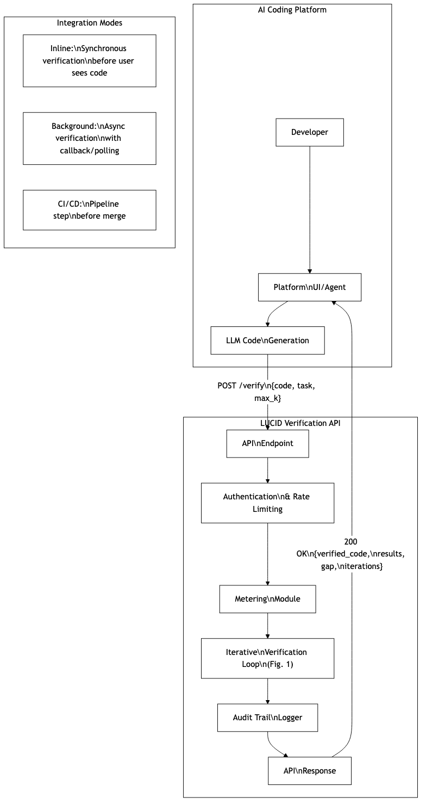
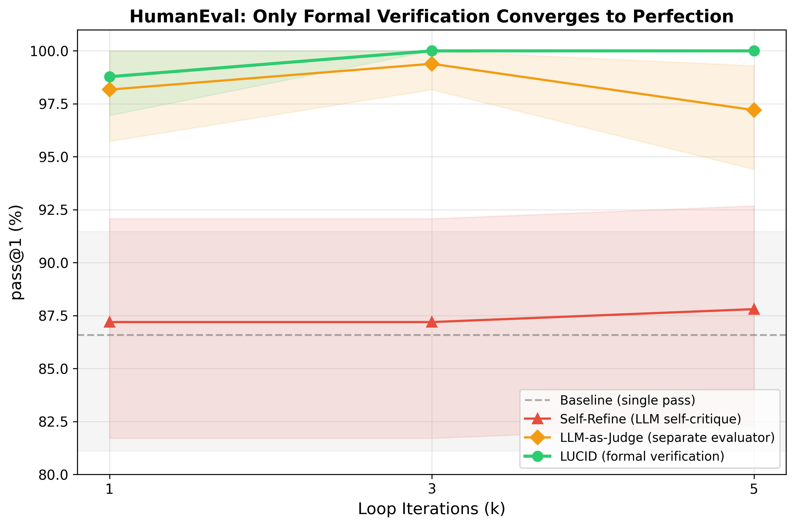
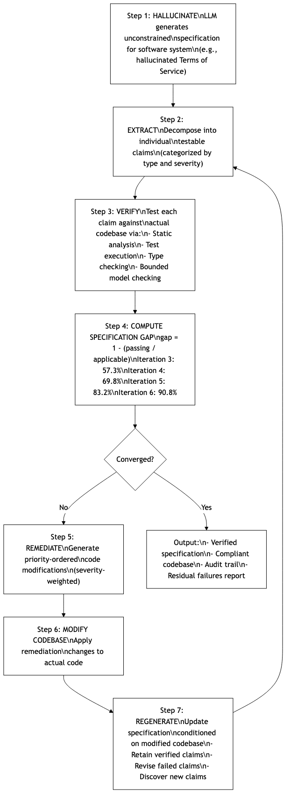
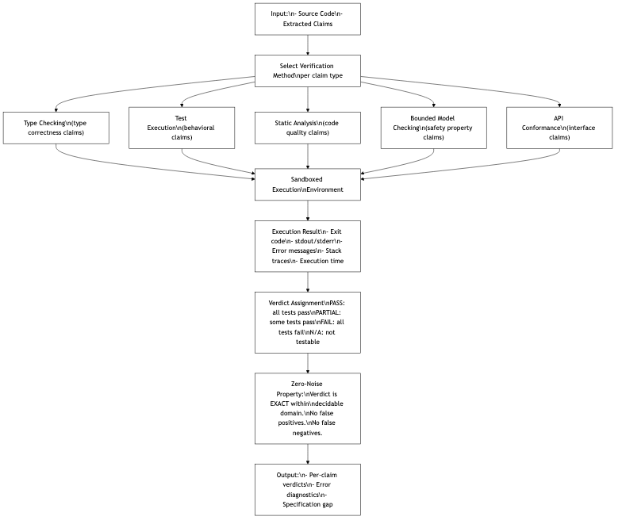
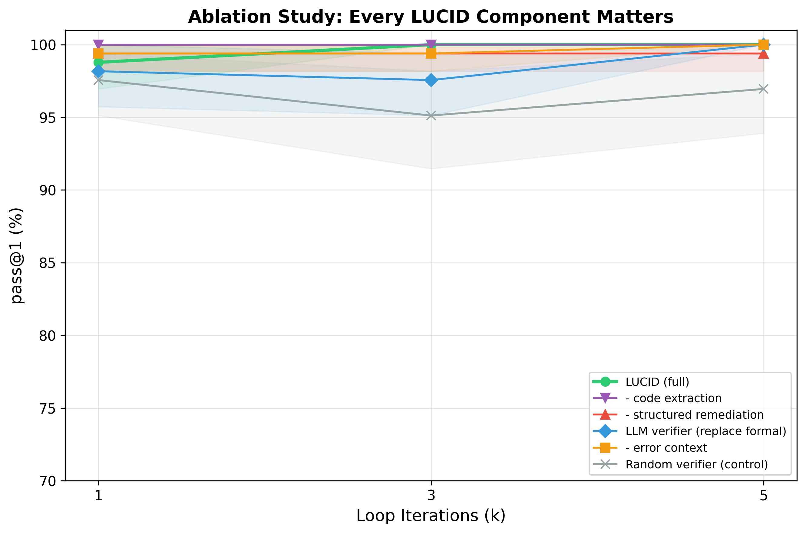

## FIG. 1 — Main LUCID Pipeline Flow

{ width=90% }

\newpage

## FIG. 2 — Verification Loop Iteration Detail

{ width=90% }

\newpage

## FIG. 3 — API Request/Response Flow

{ width=90% }

\newpage

## FIG. 4 — Convergence Comparison: LUCID vs. Alternatives

{ width=90% }

\newpage

## FIG. 5 — Specification-Level Variant

{ width=90% }

\newpage

## FIG. 6 — Formal Verification Engine Detail

{ width=90% }

\newpage

## FIG. 7 — Ablation Study Results

{ width=90% }

\newpage

