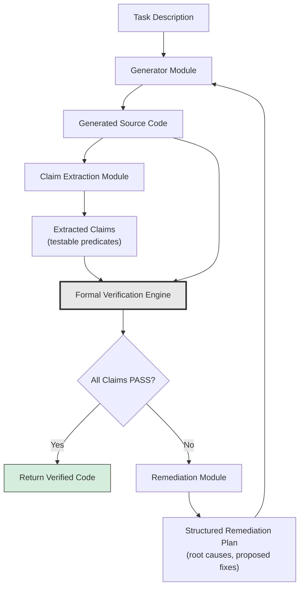
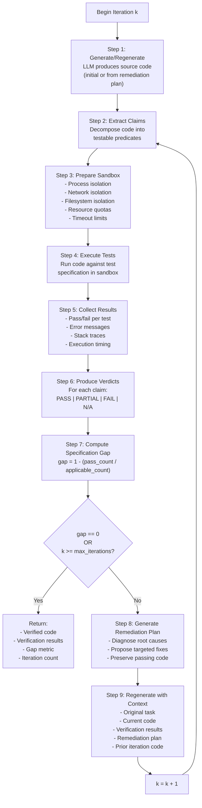
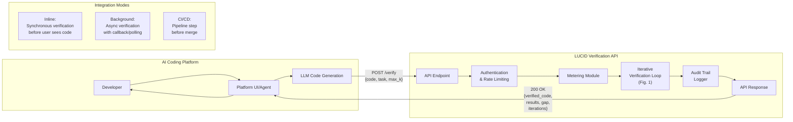
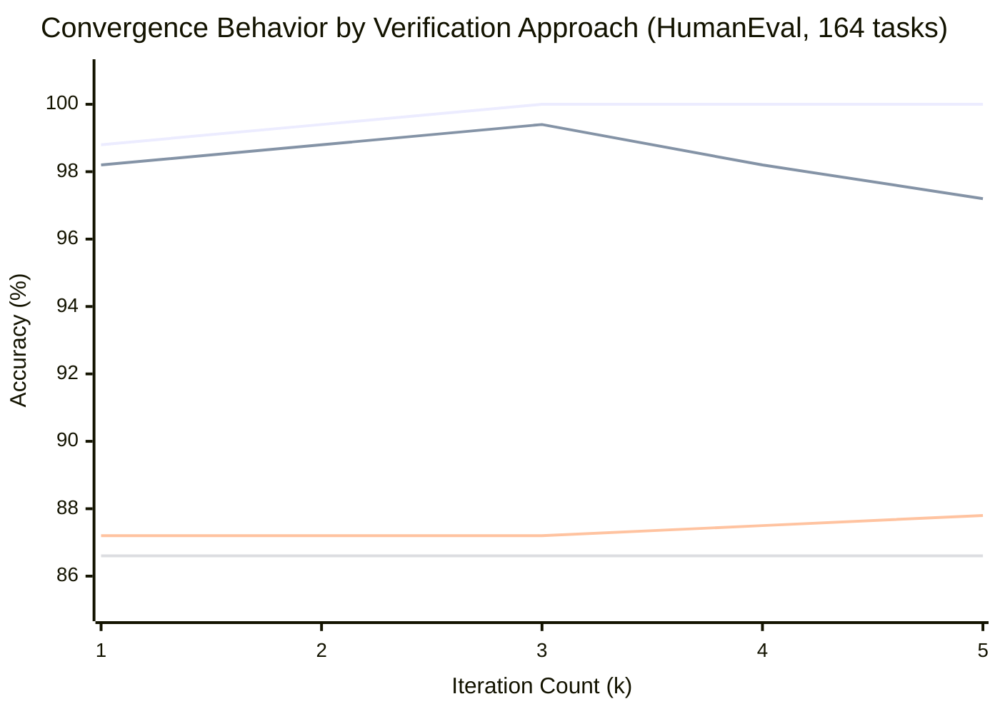
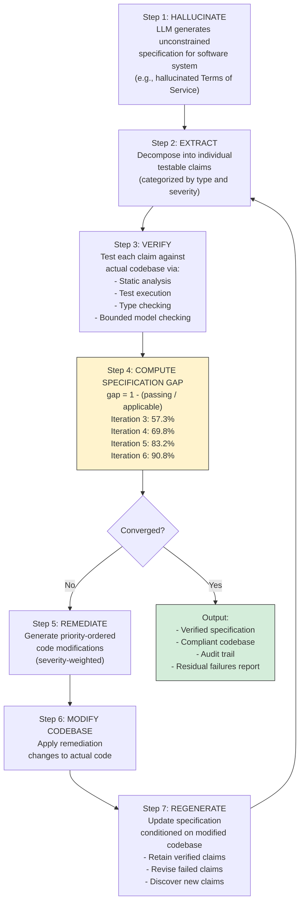
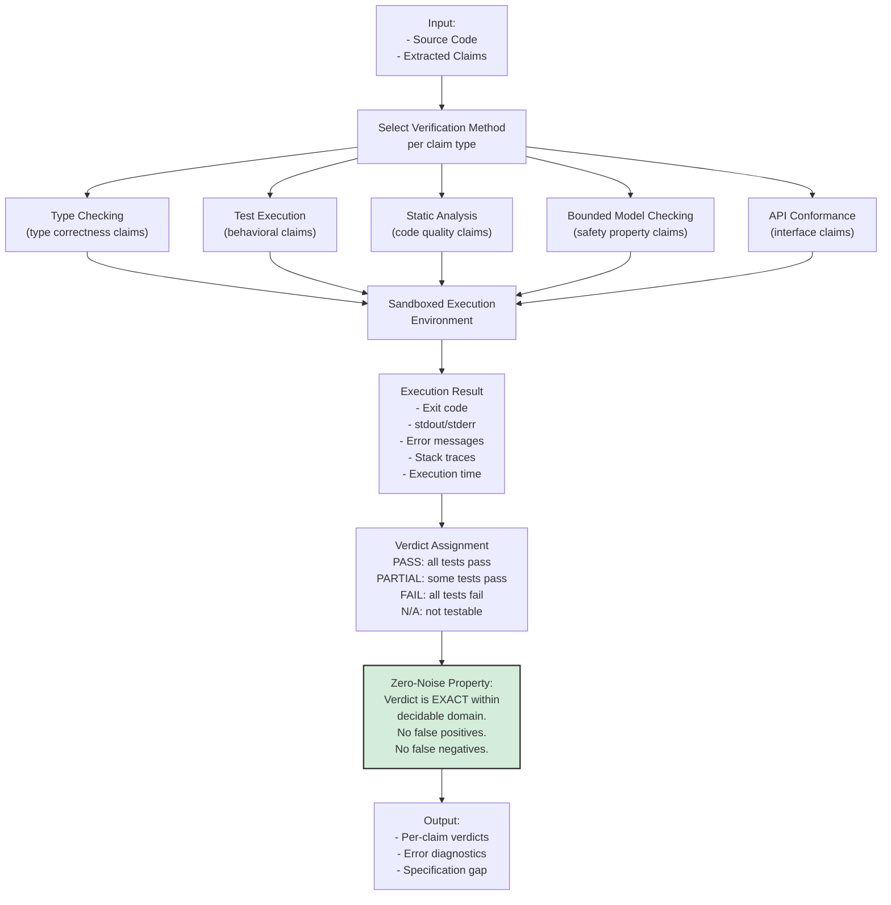
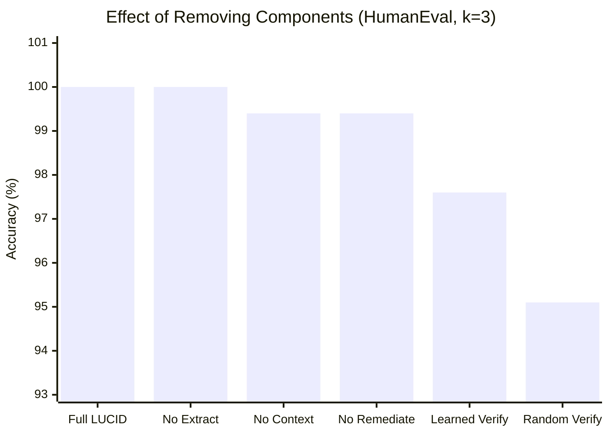

# PATENT FLOWCHARTS

## System and Method for Iterative Formal Verification of AI-Generated Code Using a Hallucination-Verification Loop

These flowcharts describe the key processes of the invention. For USPTO filing, these should be rendered as formal patent drawings (black and white, numbered figures) by a patent illustrator.

---

## Figure 1: Main LUCID Pipeline Flow

This figure illustrates the overall system architecture and data flow between the four principal components.

**Description:** The flowchart shows a task description (100) entering a Generator Module (110), which produces Generated Source Code (120). The source code flows to a Claim Extraction Module (130), which produces a set of Extracted Claims (140). Both the source code and the extracted claims flow to a Formal Verification Engine (150), which executes the code against test specifications. A decision point (160) evaluates whether all claims pass. If yes, the verified code is returned (170). If no, the verification results flow to a Remediation Module (180), which produces a Structured Remediation Plan (190). The remediation plan feeds back to the Generator Module (110) to produce updated source code, completing the iterative loop.

---

## Figure 2: Verification Loop Iteration Detail

This figure illustrates the detailed process within a single iteration of the verification loop.

**Description:** The flowchart details one complete iteration cycle. Starting from a generate or regenerate step (200), the system extracts claims (210), prepares a sandboxed execution environment (220), executes tests (230), collects detailed results including error messages and stack traces (240), produces per-claim verdicts (250), and computes the specification gap metric (260). A decision point (270) checks if convergence has been achieved (gap equals zero) or the maximum iteration count reached. If yes, verified code is returned with full results (280). If not, a remediation plan is generated (290) using the specific failure diagnostics, and the system regenerates code with full context preservation (300) before incrementing the iteration counter and returning to the extraction step.

---

## Figure 3: API Request/Response Flow

This figure illustrates how the system is exposed as an API service for integration with AI coding platforms.

**Description:** The flowchart shows an AI Coding Platform (400) containing a developer (410), platform interface (420), and LLM code generation (430). The platform sends a verification request (POST /verify) containing the generated code, task description, and maximum iteration count to the LUCID Verification API (440). Within the API, the request passes through authentication and rate limiting (450), metering for billing (460), the iterative verification loop (470, referencing Figure 1), and audit trail logging (480). The API returns a response (490) containing the verified code, per-claim results, specification gap metric, and iteration count. Three integration modes are shown: inline synchronous (500), background asynchronous (510), and CI/CD pipeline integration (520).

---

## Figure 4: Convergence Comparison — LUCID vs. Alternatives

This figure illustrates the divergent convergence behaviors of different verification approaches, demonstrating the monotonic convergence property unique to the present invention.

**Description (for formal patent drawing):** A line chart showing accuracy (y-axis, 85-100%) versus iteration count (x-axis, k=1 through k=5) for four verification approaches:

- **LUCID (present invention):** Solid line with filled circles. Starts at 98.8% (k=1), increases to 100% (k=3), and maintains 100% (k=4, k=5). Monotonically non-decreasing. The only line that reaches 100% and stays there.

- **LLM-as-Judge:** Dashed line with open squares. Starts at 98.2% (k=1), rises to 99.4% (k=3), then **regresses** to 97.2% (k=5). The regression is the critical finding: learned verification accumulates false positives that corrupt correct solutions at higher iteration counts.

- **Self-Refine:** Dotted line with open triangles. Starts at 87.2% (k=1) and remains essentially flat through k=5 (87.8%). Self-critique provides negligible improvement because the critic shares the generator's blind spots.

- **Baseline:** Dash-dot line (flat). At 86.6% for all values of k (single-pass generation, no iterations).

Key annotation: An arrow pointing to the LLM-as-Judge regression at k=5 with label "False positives cause regression." An arrow pointing to the LUCID line at k=3 with label "Monotonic convergence to 100%."

---

## Figure 5: Specification-Level Variant (Specification Gap Minimization)

This figure illustrates the specification-level variant of the system, where the loop operates on entire codebases against hallucinated specifications.

**Description:** The flowchart shows the specification-level variant. Step 1 (600) uses the LLM to generate an unconstrained specification. Step 2 (610) decomposes the specification into testable claims categorized by type (functionality, security, data privacy, operational, legal) and severity (critical, high, medium, low). Step 3 (620) verifies each claim against the actual codebase. Step 4 (630) computes the specification gap with empirical convergence data shown (57.3% to 90.8% across iterations 3-6). A decision point (640) checks for convergence. If not converged, Step 5 (650) generates a severity-weighted remediation plan, Step 6 (660) applies modifications to the codebase, and Step 7 (670) regenerates the specification conditioned on the improved codebase. The loop repeats until convergence, producing a verified specification and compliant codebase with full audit trail (680).

---

## Figure 6: Formal Verification Engine Detail

This figure illustrates the internal architecture of the Formal Verification Engine, the core innovative component.

**Description:** The flowchart details the Formal Verification Engine's internal process. Input (700) comprises source code and extracted claims. A selection step (710) routes each claim to the appropriate verification method: type checking (720), test execution (730), static analysis (740), bounded model checking (750), or API conformance checking (760). All verification methods execute within a sandboxed environment (770). Execution results (780) include exit codes, standard output/error streams, error messages, stack traces, and execution timing. A verdict assignment step (790) maps execution results to per-claim verdicts. A key callout (800) highlights the zero-noise property: within the decidable domain, verdicts are exact with no false positives or false negatives. This is the fundamental property that distinguishes the formal verification engine from all learned verification approaches and enables monotonic convergence. The output (810) comprises per-claim verdicts, error diagnostics, and the computed specification gap.

---

## Figure 7: Ablation Study Results (Component Contribution)

This figure illustrates the contribution of each system component, as demonstrated by ablation studies.

**Description (for formal patent drawing):** A bar chart showing the accuracy at k=3 iterations for the full system and five ablation conditions:

| Condition | Accuracy (k=3) | Effect |
|-----------|----------------|--------|
| Full LUCID | 100.0% | Reference |
| No Extract | 100.0% | No effect (simple tasks) |
| No Context | 99.4% | -0.6 pp (slower convergence) |
| No Remediate | 99.4% | -0.6 pp (plateaus, cannot reach 100%) |
| Learned Verify | 97.6% | -2.4 pp (non-monotonic) |
| Random Verify | 95.1% | -4.9 pp (diverges) |

Key annotation: The "Random Verify" bar is highlighted with a downward arrow labeled "Noise causes divergence." The "Learned Verify" bar has a warning icon labeled "Non-monotonic (unreliable)." The "No Remediate" bar has a plateau icon labeled "Plateaus at 99.4%."

The chart demonstrates that the formal verification engine is the most critical component: its removal (random or learned replacement) has the largest negative impact on accuracy.

---

## DRAWING DESCRIPTION SUMMARY

| Figure | Title | Purpose |
|--------|-------|---------|
| Fig. 1 | Main LUCID Pipeline Flow | Overall system architecture showing the iterative loop between Generator, Claim Extractor, Formal Verifier, and Remediator |
| Fig. 2 | Verification Loop Iteration Detail | Detailed steps within a single iteration including sandbox preparation, execution, result collection, and convergence check |
| Fig. 3 | API Request/Response Flow | How the system is exposed as an API for integration with AI coding platforms, showing three integration modes |
| Fig. 4 | Convergence Comparison | Line chart proving monotonic convergence of LUCID vs. regression of LLM-as-Judge and plateau of Self-Refine |
| Fig. 5 | Specification-Level Variant | The broader application where LUCID operates on entire codebases against hallucinated specifications |
| Fig. 6 | Formal Verification Engine Detail | Internal architecture of the core innovative component, highlighting the zero-noise property |
| Fig. 7 | Ablation Study Results | Bar chart showing component contributions, proving formal verification is the critical component |

---

## NOTES FOR PATENT ILLUSTRATOR

1. All figures should be rendered as black-and-white line drawings per USPTO requirements (no color, no grayscale fills).
2. Each element should be numbered (100, 110, 120, ...) consistent with the description numbers in this document.
3. Charts (Figures 4, 7) should use distinct line styles (solid, dashed, dotted, dash-dot) and marker styles (filled circle, open square, open triangle, x) to distinguish data series without color.
4. The iterative loop arrows (Figures 1, 2, 5) should be prominently rendered to show the feedback structure.
5. Decision diamonds should use standard flowchart conventions.
6. The zero-noise property callout in Figure 6 should be prominently boxed as it represents the key inventive concept.
